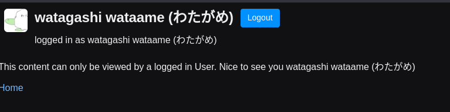

# Reflex synchronous deviation bug with google auth

Authentication using GoogleAuth and strange synchronization issues with background tasks

## How to reproduce

1. Create .env file and pass google
   ```shell
    cp .env.example .env
    # Edit .env
    ```
2. Run the following command
   ```shell
   docker compose up --build
   ```
3. Access `http://localhost:8000/protected` and login with google account
4. The background task repeatedly login and logout.
   

> Btw, local environment using `reflex run` works fine.